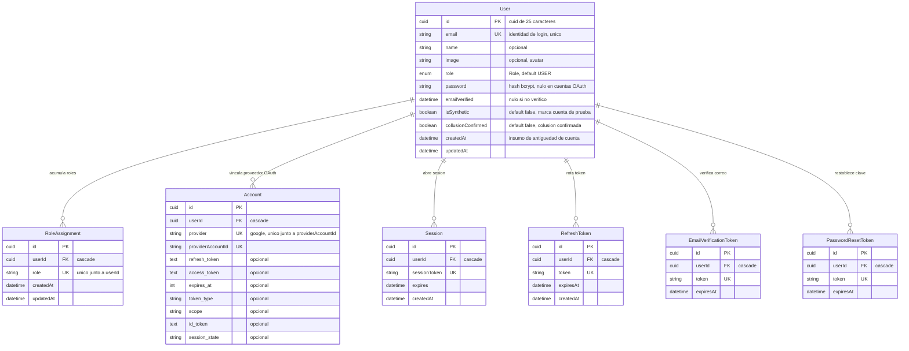
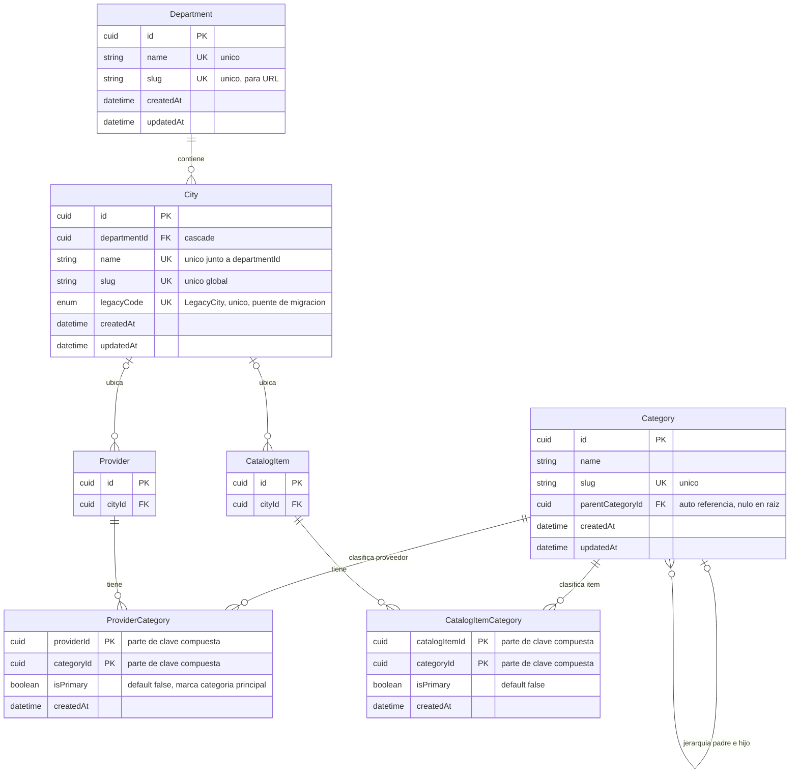
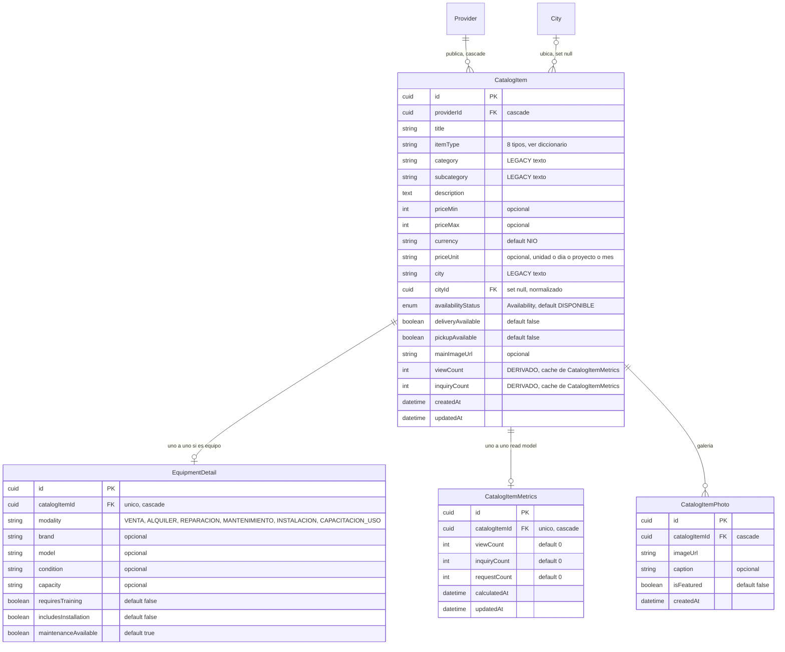
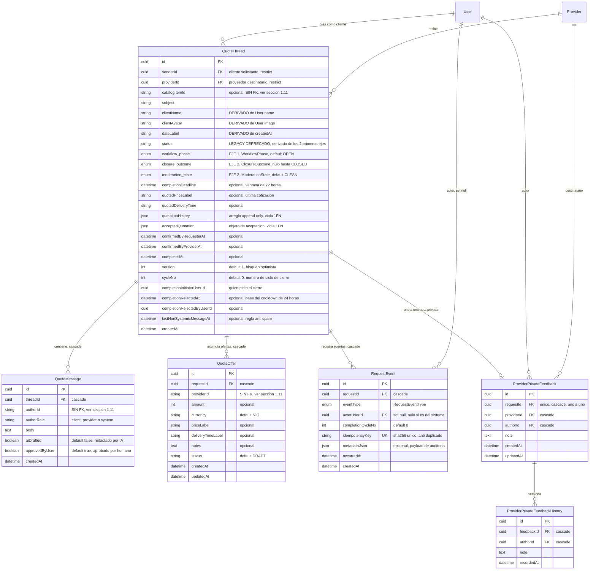
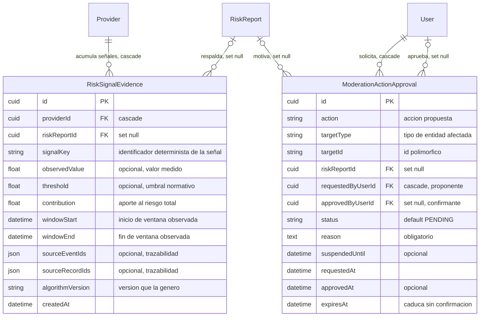

# 1. Modelo Entidad-Relación normalizado (3FN)

**Proyecto:** TradeArc / Conecta Emprende AI · **Motor:** PostgreSQL 15 · **ORM:** Prisma 5.22
**Fuente de verdad:** `prisma/schema.prisma` (40 tablas, 10 enums) + 28 migraciones en `prisma/migrations/`
**Visor interactivo:** `er-relacional.html` (pestañas por módulo, zoom y exportación a SVG/PNG)

> Este ER no es una propuesta teórica: se derivó tabla por tabla del esquema Prisma que corre en el MVP. Cada denormalización que sobrevive está declarada en el documento `06-normalizacion-deuda.md` con su motivo y su plan de retiro, en lugar de esconderse.

---

## 1.1 Convenciones y notación

| Símbolo | Significado |
|---|---|
| `PK` | Clave primaria. Todas son `cuid()` de 25 caracteres (surrogate key), salvo las dos tablas puente con clave compuesta natural. |
| `FK` | Clave foránea |
| `UK` | Restricción de unicidad (simple o parte de una compuesta) |
| `\|\|--o{` | Uno obligatorio hacia muchos, cero o más |
| `\|o--o{` | Cero o uno hacia muchos, cero o más |
| `\|\|--o\|` | Uno obligatorio hacia cero o uno (relación 1:1 opcional) |
| `}o--\|\|` | Muchos hacia uno obligatorio |

Notas de tipo: `cuid` = `TEXT`; `enum` = tipo enumerado nativo de PostgreSQL; `json` = `JSONB`; `datetime` = `TIMESTAMP(3)`.

### Enumerados del dominio

| Enum | Valores |
|---|---|
| `Role` | `USER`, `PROVIDER`, `ADMIN`, `ADMIN_REVIEWER`, `SUPER_ADMIN` |
| `ProviderStatus` | `DRAFT`, `ACTIVE`, `INACTIVE`, `TEMPORARILY_RESTRICTED`, `SUSPENDED`, `BANNED` |
| `Availability` | `DISPONIBLE`, `OCUPADO`, `BAJO_PEDIDO`, `NO_DISPONIBLE_TEMPORALMENTE` |
| `FormalizationStatus` | `INFORMAL`, `EN_PROCESO`, `MIPYME_FORMAL`, `DOCUMENTOS_PENDIENTES` |
| `WorkflowPhase` | `OPEN`, `COMPLETION_PENDING`, `CLOSED` |
| `ClosureOutcome` | `BILATERAL`, `REQUESTER_CONFIRMED_PROVIDER_NO_RESPONSE`, `PROVIDER_CLAIMED_REQUESTER_NO_RESPONSE`, `CANCELLED_BY_REQUESTER`, `CANCELLED_BY_PROVIDER`, `CANCELLED_BY_PROVIDER_AFTER_ENGAGEMENT`, `MODERATION_CLOSURE`, `DECLINED_BY_PROVIDER`, `EXPIRED_NO_PROVIDER_RESPONSE`, `ACCOUNT_DEACTIVATED`, `CLOSED_BY_ADMIN` |
| `ModerationState` | `CLEAN`, `FLAGGED`, `RESTRICTED` |
| `RequestEventType` | 19 valores; ledger de eventos de solicitud |
| `EvidenceType` | `BILATERAL_COMPLETION`, `UNILATERAL_REVIEW_QUALIFIED`, `UNILATERAL_REVIEW_UNQUALIFIED`, `CONTACT_CONFIRMATION`, `PENALTY_SUSPICIOUS_ACTIVITY`, `PENALTY_POLICY_VIOLATION` |
| `LegacyCity` | 10 ciudades de Nicaragua. **Enum de transición**, reemplazado por la tabla `City` |

---

## 1.2 Vista global: estructura relacional en 3FN

Solo claves primarias y foráneas, para leer la topología completa de una sola vez. Las 40 tablas se agrupan en 6 módulos.

> El diagrama global embebido aquí cubre las 38 tablas del núcleo. Las dos tablas del circuito de riesgo del Sprint 9, `RiskSignalEvidence` y `ModerationActionApproval`, están documentadas en §1.12 y se muestran en el visor interactivo `er-relacional.html`.

```mermaid
erDiagram
    User ||--o{ RoleAssignment : "acumula"
    User ||--o{ Account : "vincula"
    User ||--o{ Session : "abre"
    User ||--o{ RefreshToken : "rota"
    User ||--o{ EmailVerificationToken : "verifica con"
    User ||--o{ PasswordResetToken : "restablece con"
    User ||--o{ Provider : "es dueño de"
    User ||--o{ QuoteThread : "solicita como cliente"
    User ||--o{ Review : "redacta"
    User ||--o{ ModerationAuditLog : "actúa en"
    User |o--o{ RequestEvent : "origina"
    User |o--o{ RiskReport : "revisa o escala o resuelve"
    User |o--o{ ReputationEvent : "invalida"
    User ||--o{ ProviderPrivateFeedback : "escribe"
    User ||--o{ ProviderPrivateFeedbackHistory : "versiona"
    User |o--o{ Provider : "cambia estado de"

    Department ||--o{ City : "agrupa"
    City |o--o{ Provider : "localiza"
    City |o--o{ CatalogItem : "localiza"
    Category |o--o{ Category : "es padre de"
    Category ||--o{ ProviderCategory : "clasifica"
    Category ||--o{ CatalogItemCategory : "clasifica"

    Provider ||--o{ ProviderCategory : "se clasifica en"
    Provider ||--o| TrustScore : "tiene score v1"
    Provider ||--o| ProviderMetrics : "tiene metricas"
    Provider ||--o| FormalizationChecklist : "tiene checklist"
    Provider ||--o{ FormalizationStep : "avanza en"
    Provider ||--o{ ProviderBusinessHour : "atiende en"
    Provider ||--o{ ProviderDeliveryOption : "entrega con"
    Provider ||--o{ ProviderPhoto : "muestra"
    Provider ||--o{ ProviderMedal : "gana"
    Provider ||--o{ CatalogItem : "publica"
    Provider ||--o{ QuoteThread : "recibe"
    Provider ||--o{ Review : "es reseñado en"
    Provider ||--o{ TrustScoreSnapshot : "historiza"
    Provider ||--o{ RiskReport : "es analizado en"
    Provider ||--o{ ReputationEvent : "acumula evidencia"
    Provider ||--o{ ProviderPrivateFeedback : "recibe privado"

    CatalogItem ||--o| EquipmentDetail : "detalla si es equipo"
    CatalogItem ||--o| CatalogItemMetrics : "tiene metricas"
    CatalogItem ||--o{ CatalogItemPhoto : "ilustra con"
    CatalogItem ||--o{ CatalogItemCategory : "se clasifica en"

    QuoteThread ||--o{ QuoteMessage : "contiene"
    QuoteThread ||--o{ QuoteOffer : "negocia"
    QuoteThread ||--o{ Review : "habilita"
    QuoteThread ||--o{ RequestEvent : "registra"
    QuoteThread |o--o{ ReputationEvent : "genera"
    QuoteThread ||--o| ProviderPrivateFeedback : "cierra con"

    Review ||--o| ReviewAnalysis : "se analiza en"
    Review ||--o{ ReviewHistory : "versiona en"
    RequestEvent |o--o{ ReputationEvent : "es origen de"
    ProviderPrivateFeedback ||--o{ ProviderPrivateFeedbackHistory : "versiona en"

    User {
        cuid id PK
        string email UK
        enum role
    }
    RoleAssignment {
        cuid id PK
        cuid userId FK
        string role UK
    }
    Account {
        cuid id PK
        cuid userId FK
        string provider UK
        string providerAccountId UK
    }
    Session {
        cuid id PK
        cuid userId FK
        string sessionToken UK
    }
    RefreshToken {
        cuid id PK
        cuid userId FK
        string token UK
    }
    EmailVerificationToken {
        cuid id PK
        cuid userId FK
        string token UK
    }
    PasswordResetToken {
        cuid id PK
        cuid userId FK
        string token UK
    }
    Department {
        cuid id PK
        string name UK
        string slug UK
    }
    City {
        cuid id PK
        cuid departmentId FK
        string name UK
        string slug UK
        enum legacyCode UK
    }
    Category {
        cuid id PK
        string slug UK
        cuid parentCategoryId FK
    }
    Provider {
        cuid id PK
        cuid userId FK
        string slug UK
        cuid cityId FK
        cuid statusUpdatedById FK
        enum status
    }
    ProviderCategory {
        cuid providerId PK
        cuid categoryId PK
        boolean isPrimary
    }
    ProviderBusinessHour {
        cuid id PK
        cuid providerId FK
        int dayOfWeek UK
    }
    ProviderDeliveryOption {
        cuid id PK
        cuid providerId FK
        string label UK
    }
    ProviderPhoto {
        cuid id PK
        cuid providerId FK
        string catalogItemId
    }
    ProviderMedal {
        cuid id PK
        cuid providerId FK
        string medalType
    }
    TrustScore {
        cuid id PK
        cuid providerId FK
        float finalScore
    }
    ProviderMetrics {
        cuid id PK
        cuid providerId FK
        float trustScore
        float publicTrustScore
    }
    FormalizationChecklist {
        cuid id PK
        cuid providerId FK
        json steps
    }
    FormalizationStep {
        cuid id PK
        cuid providerId FK
        string code UK
    }
    CatalogItem {
        cuid id PK
        cuid providerId FK
        cuid cityId FK
        string itemType
    }
    CatalogItemCategory {
        cuid catalogItemId PK
        cuid categoryId PK
        boolean isPrimary
    }
    CatalogItemMetrics {
        cuid id PK
        cuid catalogItemId FK
    }
    EquipmentDetail {
        cuid id PK
        cuid catalogItemId FK
        string modality
    }
    CatalogItemPhoto {
        cuid id PK
        cuid catalogItemId FK
    }
    QuoteThread {
        cuid id PK
        cuid senderId FK
        cuid providerId FK
        string catalogItemId
        enum workflow_phase
        enum closure_outcome
        enum moderation_state
        int version
    }
    QuoteMessage {
        cuid id PK
        cuid threadId FK
        string authorId
        string authorRole
    }
    QuoteOffer {
        cuid id PK
        cuid requestId FK
        string providerId
        string status
    }
    RequestEvent {
        cuid id PK
        cuid requestId FK
        cuid actorUserId FK
        enum eventType
        string idempotencyKey UK
    }
    ReputationEvent {
        cuid id PK
        cuid providerId FK
        cuid requestId FK
        cuid sourceEventId FK
        cuid invalidatedByAdminId FK
        enum evidenceType UK
        float evidenceWeight
    }
    ProviderPrivateFeedback {
        cuid id PK
        cuid requestId FK
        cuid providerId FK
        cuid authorId FK
    }
    ProviderPrivateFeedbackHistory {
        cuid id PK
        cuid feedbackId FK
        cuid authorId FK
    }
    Review {
        cuid id PK
        cuid providerId FK
        cuid reviewerId FK
        cuid requestId FK
        float generalScore
        float weight
    }
    ReviewHistory {
        cuid id PK
        cuid reviewId FK
        string editedByUserId
    }
    ReviewAnalysis {
        cuid id PK
        cuid reviewId FK
    }
    TrustScoreSnapshot {
        cuid id PK
        cuid providerId FK
        float finalScore
    }
    RiskReport {
        cuid id PK
        cuid providerId FK
        cuid reviewedByUserId FK
        cuid escalatedByUserId FK
        cuid resolvedByUserId FK
        float riskScore
    }
    ModerationAuditLog {
        cuid id PK
        cuid actorUserId FK
        string targetType
        string targetId
    }
```

**Lectura rápida de la topología:** hay dos agregados raíz (`User` y `Provider`) y un agregado transaccional (`QuoteThread`). Todo lo demás es satélite de uno de esos tres. `Review` es la única entidad que depende simultáneamente de los tres (`providerId` + `reviewerId` + `requestId`), y esa triple dependencia es justamente la que hace verificable la reseña: no existe reseña sin una solicitud real que la respalde.

---

## 1.3 Módulo A: identidad y acceso

**Decisión de diseño relevante:** el rol vive en dos lugares por diseño, no por descuido. `User.role` es el rol primario del enum `Role` y `RoleAssignment` es la tabla de asignaciones múltiples. El backend resuelve los permisos con la unión de ambos (`getUserSystemRoles`, `server.ts:254`), lo que permite que una persona sea a la vez proveedora y revisora administrativa. `RoleAssignment.role` es `String` y no el enum `Role` a propósito: habilita roles operativos que no forman parte del enum de negocio.

---

## 1.4 Módulo B: ubicación y categorías (datos de referencia)

Tres piezas de normalización viven acá y valen la pena por separado:

1. **`Department` hacia `City`** elimina la dependencia transitiva ciudad-departamento que antes se repetía como texto en cada perfil.
2. **`Category` auto-referenciada** modela la jerarquía categoría/subcategoría con profundidad arbitraria en una sola tabla, en lugar de las columnas planas `category` + `mainCategory` + `subcategories[]`.
3. **`ProviderCategory` / `CatalogItemCategory`** resuelven la relación M:N con clave compuesta natural. El atributo `isPrimary` es el ejemplo de libro de un dato que pertenece a la relación y no a ninguna de las dos entidades: una categoría no es "principal" en abstracto, lo es *para un proveedor concreto*.

---

## 1.5 Módulo C: proveedor y su perfil

```mermaid
erDiagram
    User ||--o{ Provider : "posee, cascade"
    User |o--o{ Provider : "actualizo estado, set null"
    Provider ||--o| TrustScore : "score v1, uno a uno"
    Provider ||--o| ProviderMetrics : "read model, uno a uno"
    Provider ||--o{ ProviderBusinessHour : "horario por dia"
    Provider ||--o{ ProviderDeliveryOption : "opciones de entrega"
    Provider ||--o{ ProviderPhoto : "galeria"
    Provider ||--o{ ProviderMedal : "medallas"
    Provider ||--o| FormalizationChecklist : "checklist, uno a uno"
    Provider ||--o{ FormalizationStep : "pasos roadmap"

    Provider {
        cuid id PK
        cuid userId FK "cascade, dueño"
        string displayName
        string slug UK "unico, URL publica"
        text bio "opcional"
        string logoUrl "opcional"
        string coverImageUrl "opcional"
        cuid cityId FK "set null, normalizado"
        enum city "LEGACY LegacyCity, ver doc 06"
        string department "LEGACY derivado, ver doc 06"
        string serviceRadius "opcional"
        string category "LEGACY texto, ver doc 06"
        string mainCategory "LEGACY texto, ver doc 06"
        string_array subcategories "LEGACY arreglo, viola 1FN"
        int priceMin "opcional"
        int priceMax "opcional"
        string priceRange "DERIVADO de priceMin y priceMax"
        string businessHours "LEGACY texto compuesto"
        string_array deliveryOptions "LEGACY arreglo, viola 1FN"
        enum availability "Availability, default DISPONIBLE"
        enum status "ProviderStatus, default DRAFT"
        text statusReason "opcional, motivo de moderacion"
        datetime suspendedUntil "opcional"
        datetime statusUpdatedAt "opcional"
        cuid statusUpdatedById FK "set null, admin que actuo"
        boolean verified "default false"
        string verificationLevel "opcional, etiqueta"
        enum formalizationStatus "default INFORMAL"
        float profileCompleteness "DERIVADO, cache de ProviderMetrics"
        float responseTimeHrs "DERIVADO, cache de ProviderMetrics"
        int completedRequests "DERIVADO, cache de ProviderMetrics"
        float lat "opcional, Leaflet"
        float lng "opcional, Leaflet"
        varchar shortDescription "max 200, requerido para publicar"
        text aboutDescription "requerido para publicar"
        datetime createdAt
        datetime activatedAt "opcional, fecha de publicacion"
        datetime updatedAt
    }
    ProviderBusinessHour {
        cuid id PK
        cuid providerId FK "cascade"
        int dayOfWeek UK "0 a 6, unico junto a providerId"
        string opensAt "opcional, formato HH MM"
        string closesAt "opcional, formato HH MM"
        boolean isClosed "default false"
        string note "opcional"
    }
    ProviderDeliveryOption {
        cuid id PK
        cuid providerId FK "cascade"
        string label UK "unico junto a providerId"
        string details "opcional"
        datetime createdAt
    }
    ProviderPhoto {
        cuid id PK
        cuid providerId FK "cascade"
        string catalogItemId "SIN FK, ver seccion 1.11"
        string imageUrl
        string caption "opcional"
        string photoType "PRODUCTO, SERVICIO_REALIZADO, TALLER_O_LOCAL, EQUIPO_PRODUCTIVO, ENTREGA, PORTAFOLIO"
        boolean isFeatured "default false"
        datetime createdAt
    }
    ProviderMedal {
        cuid id PK
        cuid providerId FK "cascade"
        string medalType "7 tipos, ver diccionario"
        datetime earnedAt
        string sourceEvent "evento que la otorgo"
    }
    TrustScore {
        cuid id PK
        cuid providerId FK "unico, uno a uno"
        float scoreCompleteness
        float scoreTransactions
        float scoreResponseTime
        float scoreReviews
        float scoreFormalization
        float finalScore
        string algorithmVersion "default v1-rule-based"
        json features "opcional, features del calculo"
        datetime computedAt
    }
    ProviderMetrics {
        cuid id PK
        cuid providerId FK "unico, cascade, uno a uno"
        float avgRating "opcional"
        int totalVerifiedReviews "default 0"
        float profileCompleteness "default 0"
        float responseTimeHrs "opcional"
        int completedRequests "default 0"
        int requestsResponded "default 0"
        float suspiciousActivityPenalty "default 0"
        float trustScore "interno, nunca se expone"
        float publicTrustScore "opcional, el unico publicable"
        string evidenceLevel "default INSUFFICIENT_EVIDENCE"
        boolean publicScoreFrozen "default false"
        boolean growthHold "default false, freno por riesgo"
        string algorithmVersion "default trust-v2.0.0"
        int bilateralCompletions "default 0"
        int uniqueRequesters "default 0"
        datetime lastRecalculatedAt "opcional"
        datetime calculatedAt
        datetime updatedAt
    }
    FormalizationChecklist {
        cuid id PK
        cuid providerId FK "unico, cascade, uno a uno"
        json steps "LEGACY arreglo JSON, viola 1FN"
        datetime updatedAt
    }
    FormalizationStep {
        cuid id PK
        cuid providerId FK "cascade, nulo si es paso plantilla"
        string code UK "unico junto a providerId"
        string title
        text description "opcional"
        int sortOrder "default 0"
        boolean isRequired "default false"
        string status "default ROADMAP"
        datetime createdAt
        datetime updatedAt
    }
```

**`User` 1 hacia N `Provider` es intencional:** una persona puede tener varios negocios. Eso obliga a que el control de acceso sea por pertenencia y no por rol (`getProviderOwnedByUser`, `server.ts:226`).

**`ProviderMetrics` es un read model, no una tabla de negocio.** Guarda `trustScore` (interno) y `publicTrustScore` (publicable) como columnas separadas porque el endpoint público `GET /api/providers/:id/trust-score` solo devuelve el segundo. La separación es una regla de producto materializada en el esquema: el score interno nunca sale de la base.

---

## 1.6 Módulo D: catálogo

**`EquipmentDetail` es especialización, no relleno.** Los atributos `brand`, `model`, `condition`, `capacity`, `requiresTraining` solo aplican a ítems de tipo equipo productivo. Meterlos en `CatalogItem` habría dejado columnas nulas en la mayoría de las filas y una dependencia condicional del tipo de ítem. Extraerlos a una tabla 1:1 opcional mantiene la 3FN y modela el patrón *class table inheritance*.

---

## 1.7 Módulo E: solicitudes, mensajería y ledger de eventos

**El modelo de 3 ejes en el esquema.** `QuoteThread` no tiene un solo campo de estado, tiene tres ortogonales:

| Eje | Columna | Qué responde |
|---|---|---|
| 1. Fase | `workflow_phase` | ¿En qué punto del ciclo está? `OPEN` a `COMPLETION_PENDING` a `CLOSED`, con retorno posible a `OPEN` |
| 2. Desenlace | `closure_outcome` | ¿Por qué terminó? Se puebla solo al llegar a `CLOSED` |
| 3. Moderación | `moderation_state` | ¿Está limpia, marcada o restringida? Dimensión paralela |

La razón de separar los ejes es que la elegibilidad de reseña no depende de "si terminó" sino de "*cómo* terminó" (documento 05). Con un solo campo `status` esa distinción se vuelve imposible sin inventar decenas de valores mixtos, que es exactamente el problema que tenía el campo `status` legacy.

**`RequestEvent` es un ledger append-only con idempotencia criptográfica.** `idempotencyKey = sha256({requestId, eventType, actorUserId, completionCycleNo})` con restricción `UNIQUE`: un reintento de red no puede duplicar un evento. La función `replayRequestEvents` reconstruye el estado del hilo desde el ledger, lo que convierte a esta tabla en la fuente de verdad auditable del ciclo (event sourcing parcial).

---

## 1.8 Módulo F: confianza, reseñas y moderación

```mermaid
erDiagram
    QuoteThread ||--o{ Review : "habilita, cascade"
    Provider ||--o{ Review : "es reseñado, restrict"
    User ||--o{ Review : "reseña como cliente, restrict"
    Review ||--o| ReviewAnalysis : "uno a uno analisis"
    Review ||--o{ ReviewHistory : "versiona, cascade"
    Provider ||--o{ ReputationEvent : "acumula, cascade"
    QuoteThread |o--o{ ReputationEvent : "origina, set null"
    RequestEvent |o--o{ ReputationEvent : "evento fuente, set null"
    User |o--o{ ReputationEvent : "invalida, set null"
    Provider ||--o{ TrustScoreSnapshot : "historiza, cascade"
    Provider ||--o{ RiskReport : "es analizado, cascade"
    User |o--o{ RiskReport : "revisa, escala o resuelve"
    User ||--o{ ModerationAuditLog : "actua, cascade"

    Review {
        cuid id PK
        cuid providerId FK "restrict, reseñado"
        cuid reviewerId FK "restrict, autor"
        cuid requestId FK "cascade, solicitud que la respalda"
        int qualityScore "eje 1 de 5"
        int responseTimeScore "eje 2 de 5"
        int fulfillmentScore "eje 3 de 5"
        int communicationScore "eje 4 de 5"
        int valueScore "eje 5 de 5"
        float generalScore "DERIVADO de los 5 ejes"
        text comment "opcional"
        float sentiment "DERIVADO, duplica ReviewAnalysis"
        float weight "default 1.0, es 0.5 si es unilateral"
        datetime editedAt "opcional"
        datetime createdAt "base de la ventana de 7 dias"
    }
    ReviewHistory {
        cuid id PK
        cuid reviewId FK "cascade"
        int qualityScore
        int responseTimeScore
        int fulfillmentScore
        int communicationScore
        int valueScore
        float generalScore
        text comment "opcional"
        datetime editedAt
        string editedByUserId "SIN FK, ver seccion 1.11"
    }
    ReviewAnalysis {
        cuid id PK
        cuid reviewId FK "unico, cascade"
        float sentimentScore "opcional"
        json qualitySignals "opcional"
        json moderationFlags "opcional"
        float generalScore "opcional"
        string algorithmVersion "default v1-seeded"
        datetime calculatedAt
    }
    ReputationEvent {
        cuid id PK
        cuid providerId FK "cascade"
        cuid requestId FK "set null, unico junto a evidenceType"
        enum evidenceType UK "EvidenceType"
        float evidenceWeight "1.0 bilateral o 0.5 unilateral"
        cuid sourceEventId FK "set null, RequestEvent origen"
        string algorithmVersion "default trust-v2.0.0"
        datetime invalidatedAt "opcional"
        cuid invalidatedByAdminId FK "set null"
        text invalidationReason "opcional"
        datetime createdAt
    }
    TrustScoreSnapshot {
        cuid id PK
        cuid providerId FK "cascade"
        float profileCompleteScore
        float contactVerifiedScore
        float requestsRespondedScore
        float requestsCompletedScore
        float avgReviewScore
        float responseTimeScore
        float accountAgeFactor
        float suspiciousActivityPenalty
        float finalScore
        float publicScore "opcional"
        string evidenceLevel "default INSUFFICIENT_EVIDENCE"
        json breakdown "opcional, desglose auditable"
        json caps "opcional, topes aplicados"
        string algorithmVersion "default v1-rule-based"
        datetime calculatedAt
    }
    RiskReport {
        cuid id PK
        cuid providerId FK "cascade"
        float riskScore
        int suspiciousCyclesCount "default 0"
        float avgSearchTimeSeconds "opcional"
        float avgRequestToCompletionMinutes "opcional"
        float avgMessagesPerRequest "opcional"
        float newAccountsPercentage "opcional"
        float ratingConcentrationScore "opcional"
        string status "default OPEN"
        text reviewerNotes "opcional"
        string recommendedAction "opcional"
        datetime generatedAt
        datetime reviewedAt "opcional"
        cuid reviewedByUserId FK "set null"
        datetime escalatedAt "opcional"
        cuid escalatedByUserId FK "set null"
        datetime resolvedAt "opcional"
        cuid resolvedByUserId FK "set null"
    }
    ModerationAuditLog {
        cuid id PK
        cuid actorUserId FK "cascade"
        string action "PROVIDER_SUSPENDED, REPORT_ESCALATED, entre otras"
        string targetType "tipo de entidad afectada"
        string targetId "id polimorfico, SIN FK por diseño"
        text reason "obligatorio"
        json metadata "opcional"
        datetime createdAt
    }
```

**La restricción que sostiene el producto entero:** `Review` tiene `UNIQUE (requestId, providerId, reviewerId)`. Eso significa, a nivel de base de datos y no de código, que no existe reseña sin solicitud verificable, ni dos reseñas del mismo cliente sobre el mismo proveedor por la misma solicitud. El principio de diseño "la confianza se demuestra con evidencia" (`PRODUCT.md`) está impuesto por el esquema, no por una validación que se pueda olvidar.

**`ReputationEvent` con `UNIQUE (requestId, evidenceType)`** hace que registrar la misma evidencia dos veces sea imposible incluso si el cron y la ruta HTTP corren a la vez. La idempotencia no se programa: se declara.

---

## 1.9 Análisis de normalización

### Primera forma normal (1FN)

Requisito: dominios atómicos, sin grupos repetitivos, con clave primaria en cada relación.

| Estado | Tablas | Detalle |
|---|---|---|
| Cumple | 35 de 38 | Todos los atributos son escalares y toda tabla tiene PK declarada |
| Incumple por columna de transición | `Provider`, `QuoteThread`, `FormalizationChecklist` | `subcategories String[]`, `deliveryOptions String[]`, `businessHours` texto compuesto, `quotationHistory` JSON array, `acceptedQuotation` JSON, `steps` JSON |
| JSON aceptado como payload opaco | `RequestEvent.metadataJson`, `TrustScore.features`, `TrustScoreSnapshot.breakdown` y `caps`, `ReviewAnalysis.qualitySignals` y `moderationFlags`, `ModerationAuditLog.metadata` | Datos de auditoría y telemetría con forma variable por versión de algoritmo. No se consultan relacionalmente ni participan en dependencias funcionales |

La distinción entre las dos últimas filas es la que importa en una defensa académica: un `JSONB` de auditoría cuya forma cambia con `algorithmVersion` no es una violación de 1FN en sentido útil, porque el valor es opaco para el modelo relacional. Un `JSONB` que reemplaza una relación que **ya existe normalizada al lado** (`quotationHistory` frente a `QuoteOffer`, `steps` frente a `FormalizationStep`) sí lo es, y está listado como deuda en el documento 06.

### Segunda forma normal (2FN)

Requisito: 1FN y ningún atributo no-clave con dependencia parcial de una clave compuesta.

- **36 de 38 tablas usan clave primaria simple** (`cuid`). En una relación con clave de un solo atributo no puede existir dependencia parcial, así que la 2FN se satisface por construcción.
- **Las 2 tablas con clave compuesta** son puentes M:N:
  - `ProviderCategory (providerId, categoryId)`, atributos no-clave: `isPrimary`, `createdAt`.
  - `CatalogItemCategory (catalogItemId, categoryId)`, atributos no-clave: `isPrimary`, `createdAt`.

  En ambos casos los atributos dependen de la **clave completa**: `isPrimary` describe la pareja proveedor-categoría, no al proveedor ni a la categoría por separado. **2FN cumplida.**

### Tercera forma normal (3FN)

Requisito: 2FN y ningún atributo no-clave dependiente transitivamente de la clave, ni derivado de otro atributo no-clave.

**Cumplen 3FN sin reservas (32 de 38 tablas):** `User`, `RoleAssignment`, `RefreshToken`, `Account`, `Session`, `EmailVerificationToken`, `PasswordResetToken`, `Department`, `City`, `Category`, `ProviderCategory`, `ProviderBusinessHour`, `ProviderDeliveryOption`, `ProviderPhoto`, `ProviderMedal`, `ProviderMetrics`, `ReviewHistory`, `ReviewAnalysis`, `TrustScoreSnapshot`, `RiskReport`, `ModerationAuditLog`, `CatalogItemCategory`, `CatalogItemMetrics`, `EquipmentDetail`, `CatalogItemPhoto`, `ProviderPrivateFeedback`, `ProviderPrivateFeedbackHistory`, `QuoteOffer`, `QuoteMessage`, `RequestEvent`, `ReputationEvent`, `FormalizationStep`.

**Presentan observaciones (6 de 38):** `Provider`, `CatalogItem`, `QuoteThread`, `Review`, `TrustScore`, `FormalizationChecklist`.

**Dependencias transitivas y derivadas detectadas:**

| Tabla | Atributo | Dependencia detectada | Tipo |
|---|---|---|---|
| `Provider` | `department` | `id` a `cityId` a `City.departmentId` a `Department.name` | Transitiva |
| `Provider` | `city` (enum) | `id` a `cityId` a `City.legacyCode` | Transitiva |
| `Provider` | `category`, `mainCategory` | Derivable de `ProviderCategory` unido a `Category.name` con `isPrimary` | Redundante |
| `Provider` | `priceRange` | Función de `priceMin` y `priceMax` | Derivado |
| `Provider` | `profileCompleteness`, `responseTimeHrs`, `completedRequests` | Mismo determinante que `ProviderMetrics` | Duplicado |
| `Provider` | `verificationLevel` | Función de `verified` y `formalizationStatus` | Derivado |
| `CatalogItem` | `city` | `id` a `cityId` a `City.name` | Transitiva |
| `CatalogItem` | `category`, `subcategory` | Derivable de `CatalogItemCategory` unido a `Category` | Redundante |
| `CatalogItem` | `viewCount`, `inquiryCount` | Duplican `CatalogItemMetrics` | Duplicado |
| `QuoteThread` | `status` | `getLegacyDisplayStatus(workflow_phase, closure_outcome)` | Derivado |
| `QuoteThread` | `clientName`, `clientAvatar` | `id` a `senderId` a `User.name` / `User.image` | Transitiva |
| `QuoteThread` | `dateLabel` | Función de `createdAt` | Derivado de presentación |
| `QuoteThread` | `quotedPriceLabel`, `quotedDeliveryTime` | Última entrada de `quotationHistory` / `QuoteOffer` | Duplicado |
| `Review` | `generalScore` | Promedio de los 5 ejes de puntaje | Derivado |
| `Review` | `sentiment` | Duplica `ReviewAnalysis.sentimentScore` | Duplicado |
| `TrustScore` | tabla completa | Superada por `ProviderMetrics` más `TrustScoreSnapshot`, versión v1 frente a v2 | Redundante |
| `FormalizationChecklist` | `steps` | Duplica `FormalizationStep` | Redundante |

**Conclusión:** el **núcleo transaccional del sistema está en 3FN**. Las desviaciones se concentran en dos categorías: (a) columnas legacy que sobreviven a la migración de normalización por compatibilidad con el frontend, y (b) caches de valores calculados. Ninguna desviación afecta las tablas de evidencia (`RequestEvent`, `ReputationEvent`, `Review`), que son las que sostienen la integridad del producto.

### Nota sobre BCNF

Sobre el conjunto de tablas que cumplen 3FN sin reservas, **todo determinante es clave candidata**, así que también satisfacen BCNF. Las tablas puente son el caso interesante: en `ProviderCategory` no existe ningún determinante no trivial fuera de la clave compuesta, por lo que no hay solapamiento de claves candidatas y no aparece la anomalía típica que separa 3FN de BCNF.

### Nota sobre 4FN

`Provider` tenía dos dependencias multivaluadas independientes en el diseño anterior: proveedor hacia subcategorías y proveedor hacia opciones de entrega. Convivir en la misma fila producía el producto cartesiano clásico. La migración `20260708163000_normalize_database_3nf` las extrajo a `ProviderCategory` y `ProviderDeliveryOption`, lo que lleva ese subesquema a **4FN**. Los arreglos `subcategories[]` y `deliveryOptions[]` que quedan son copias de lectura, no la fuente de escritura.

---

## 1.10 Índices y restricciones

### Restricciones de unicidad

| Tabla | Restricción | Regla de negocio que impone |
|---|---|---|
| `User` | `email` | Una identidad por correo |
| `RoleAssignment` | `(userId, role)` | Sin roles duplicados por persona |
| `Account` | `(provider, providerAccountId)` | Una cuenta OAuth externa se vincula una sola vez |
| `Session`, `RefreshToken`, `EmailVerificationToken`, `PasswordResetToken` | `token` / `sessionToken` | Token no reutilizable |
| `Department` | `name`, `slug` | Catálogo de departamentos sin duplicados |
| `City` | `slug`, `legacyCode`, `(departmentId, name)` | Ciudad única por departamento |
| `Category` | `slug` | Ruta pública estable |
| `Provider` | `slug` | URL pública única |
| `ProviderBusinessHour` | `(providerId, dayOfWeek)` | Un horario por día por negocio |
| `ProviderDeliveryOption` | `(providerId, label)` | Sin opciones repetidas |
| `TrustScore`, `ProviderMetrics`, `FormalizationChecklist` | `providerId` | Cardinalidad 1:1 real |
| `FormalizationStep` | `(providerId, code)` | Un paso por código |
| `CatalogItemMetrics`, `EquipmentDetail` | `catalogItemId` | Cardinalidad 1:1 real |
| `ReviewAnalysis` | `reviewId` | Un análisis por reseña |
| `Review` | `(requestId, providerId, reviewerId)` | **Una reseña por solicitud verificada** |
| `RequestEvent` | `idempotencyKey` | **Evento no duplicable ante reintentos** |
| `ReputationEvent` | `(requestId, evidenceType)` | **Evidencia reputacional no duplicable** |
| `ProviderPrivateFeedback` | `requestId` | Una nota privada por solicitud, versionada aparte |

### Índices secundarios destacados

| Índice | Consulta que sirve |
|---|---|
| `Provider(city)`, `Provider(cityId)`, `Provider(category)`, `Provider(mainCategory)`, `Provider(availability)`, `Provider(status)` | Búsqueda facetada del directorio |
| `Provider(slug)` | Resolución de perfil público por URL |
| `ProviderMetrics(trustScore)`, `ProviderMetrics(avgRating)`, `TrustScore(finalScore)` | Ordenamiento por confianza |
| `Review(providerId)`, `Review(reviewerId)`, `Review(requestId)`, `Review(weight)` | Listado de reseñas y recálculo ponderado |
| `QuoteThread(senderId)`, `(providerId)`, `(status)`, `(workflow_phase)`, `(completionDeadline)` | Bandeja por participante y **barrido del cron de expiración** |
| `RequestEvent(requestId, occurredAt)` | Reconstrucción cronológica del ledger |
| `ReputationEvent(providerId, createdAt)`, `(evidenceType)`, `(algorithmVersion)` | Reconstrucción del trust score por versión de algoritmo |
| `RiskReport(providerId, status, generatedAt)` | Compuesto añadido en `20260901060000` para la bandeja de moderación |
| `ModerationAuditLog(targetType, targetId)`, `(action)`, `(createdAt)` | Auditoría polimórfica |
| `TrustScoreSnapshot(providerId)`, `(calculatedAt)`, `(finalScore)` | Serie temporal de confianza |

El índice `QuoteThread(completionDeadline)` merece mención aparte: el job `resolveExpiredQuotes` corre cada 10 minutos y filtra por `workflow_phase = COMPLETION_PENDING AND completionDeadline <= now()`. Sin ese índice el barrido degrada a *sequential scan* sobre toda la tabla de solicitudes en cada ejecución.

---

## 1.11 Integridad referencial

### Matriz de acciones ante borrado

| Acción | Relaciones | Consecuencia |
|---|---|---|
| `CASCADE` | `RoleAssignment`, `Account`, `Session`, `RefreshToken`, `EmailVerificationToken`, `PasswordResetToken`, `Provider` a `User`, `City` a `Department`, `ProviderCategory`, `ProviderBusinessHour`, `ProviderDeliveryOption`, `ProviderPhoto`, `ProviderMedal`, `ProviderMetrics`, `CatalogItem` a `Provider`, `CatalogItemCategory`, `CatalogItemMetrics`, `EquipmentDetail`, `CatalogItemPhoto`, `QuoteMessage`, `QuoteOffer`, `RequestEvent` a `QuoteThread`, `Review` a `QuoteThread`, `ReviewHistory`, `ReviewAnalysis`, `ReputationEvent` a `Provider`, `TrustScoreSnapshot`, `RiskReport` a `Provider`, `ModerationAuditLog` a `User`, `FormalizationChecklist`, `FormalizationStep`, `ProviderPrivateFeedback`, `ProviderPrivateFeedbackHistory` | El satélite muere con su agregado raíz |
| `SET NULL` | `Provider.cityId`, `Provider.statusUpdatedById`, `CatalogItem.cityId`, `RequestEvent.actorUserId`, `ReputationEvent.requestId`, `ReputationEvent.sourceEventId`, `ReputationEvent.invalidatedByAdminId`, `RiskReport.reviewedByUserId`, `RiskReport.escalatedByUserId`, `RiskReport.resolvedByUserId` | **La evidencia sobrevive al actor.** Si se borra el admin que revisó un reporte, el reporte no desaparece |
| `RESTRICT` (default de Prisma en relación obligatoria) | `QuoteThread.senderId`, `QuoteThread.providerId`, `Review.providerId`, `Review.reviewerId`, `TrustScore.providerId` | **Bloquea el borrado.** No se puede eliminar un usuario o proveedor con historial transaccional |

El patrón es coherente y vale explicarlo: los datos de sesión son desechables (`CASCADE`), los datos de evidencia son inmortales (`RESTRICT` en la raíz, `SET NULL` en el actor). Un usuario con reseñas escritas o solicitudes creadas no puede borrarse; hay que desactivarlo. Eso protege el trust score de otros proveedores contra el borrado de cuentas.

### Referencias sin clave foránea declarada

Estas columnas guardan identificadores pero **no tienen restricción FK**, así que la base no garantiza que apunten a algo existente:

| Tabla | Columna | Debería referenciar | Riesgo |
|---|---|---|---|
| `QuoteOffer` | `providerId` | `Provider.id` | Oferta huérfana si se borra el proveedor |
| `QuoteMessage` | `authorId` | `User.id` | Mensaje con autor inexistente |
| `QuoteThread` | `catalogItemId` | `CatalogItem.id` | Solicitud apuntando a ítem borrado |
| `ProviderPhoto` | `catalogItemId` | `CatalogItem.id` | Foto asociada a ítem inexistente |
| `ReviewHistory` | `editedByUserId` | `User.id` | Versión sin autor rastreable |
| `QuoteThread` | `completionInitiatorUserId`, `completionRejectedByUserId` | `User.id` | Actor del ciclo de cierre sin integridad |
| `ModerationAuditLog` | `targetId` | polimórfico | **Intencional**: apunta a tipos distintos según `targetType`, una FK es imposible |

Salvo el caso polimórfico de `ModerationAuditLog`, que es una decisión de diseño correcta, los demás son deuda técnica real. Están recogidos como acción concreta en el documento 06.

---

## 1.12 Circuito de riesgo del Sprint 9

Dos tablas incorporadas después del análisis inicial, ambas en el módulo de confianza y moderación.

**`RiskSignalEvidence` cumple 3FN.** Clave simple, y todos los atributos dependen de la señal concreta observada en su ventana temporal. Los dos `JSONB` de trazabilidad son payload opaco de auditoría, del mismo tipo ya justificado en §1.9: guardan qué eventos y registros originaron la señal, no se consultan relacionalmente y su forma cambia con `algorithmVersion`.

**`ModerationActionApproval` cumple 3FN** y materializa una regla de negocio en el esquema: una acción de moderación grave nace en estado `PENDING` y necesita un `approvedByUserId` distinto del proponente para ejecutarse. El `expiresAt` obliga a que una propuesta no confirmada caduque en lugar de quedar viva indefinidamente. Igual que `ModerationAuditLog`, usa el par `targetType` + `targetId` de forma polimórfica, así que tampoco admite clave foránea sobre el objetivo.

**Cambio en `ModerationAuditLog`:** `actorUserId` pasó a ser opcional con `SET NULL`. Antes era obligatorio con `CASCADE`, lo que significaba que borrar al actor borraba la bitácora. Ahora el registro de auditoría sobrevive al borrado de la cuenta, que es el comportamiento correcto para una bitácora, y además permite acciones ejecutadas por el sistema sin actor humano.

**Efecto sobre el conteo:** el esquema pasa de 38 a **40 tablas**. Las 6 tablas con observaciones de §1.9 no cambian, así que ahora **34 de 40 cumplen 3FN sin reservas**.

---

## 1.13 Trazabilidad

| Elemento del diagrama | Origen en el código |
|---|---|
| Las 40 entidades y sus atributos | `prisma/schema.prisma` |
| Circuito de riesgo y moderación en dos pasos | `prisma/migrations/20260906120000_sprint9_risk_signal_evidence/`, `20260906140000_sprint9_moderation_two_step/` |
| Enums `WorkflowPhase`, `ClosureOutcome`, `ModerationState`, `RequestEventType` | `prisma/schema.prisma` líneas 872-935 |
| Normalización de ubicación y categorías | `prisma/migrations/20260708163000_normalize_database_3nf/` |
| Modelo de 3 ejes | `prisma/migrations/20260829000000_add_quote_3axis_baseline/` |
| Ledger de eventos | `prisma/migrations/20260903000000_sprint5_add_request_events_ledger/` |
| Evidencia reputacional | `prisma/migrations/20260829220000_add_trust_v2_fields/` |
| Índice compuesto de riesgo | `prisma/migrations/20260901060000_add_risk_report_composite_index/` |
| Feedback privado y su historial | `prisma/migrations/20260905070000_sprint7_private_provider_feedback/` y `20260905080000_sprint7_feedback_history/` |
| Derivación de `status` legacy | `src/lib/quotes-service.ts:56` función `getLegacyDisplayStatus` |
| Adaptadores de compatibilidad legacy | `docs/database-normalization-summary.md` |

---

**Siguiente:** `02-diccionario-de-datos.md` (todas las columnas con tipo y restricción) y `06-normalizacion-deuda.md` (denormalizaciones controladas y plan de retiro).
